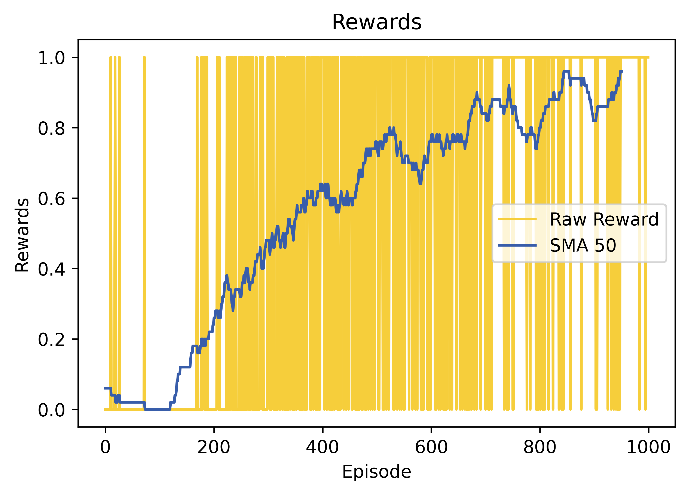
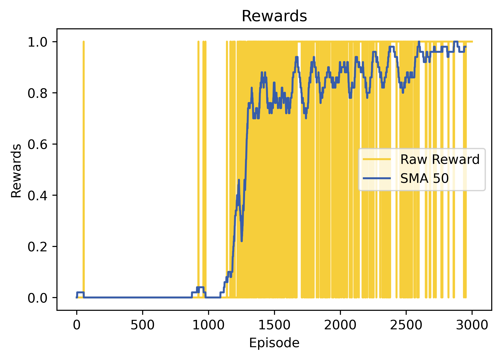

## Description
This repository hosts a Python implementation of the Deep Q-Network (DQN) algorithm, a powerful method within the realm of Deep Reinforcement Learning (DRL). We apply DQN to solve the [FrozenLake-v1](https://gymnasium.farama.org/environments/toy_text/frozen_lake/) environment :snowflake: provided by the Gymnasium library. The agent's objective is to navigate across a frozen lake :ski:, moving from the starting point :checkered_flag: to the goal :trophy: while avoiding falling into any holes :hole:. The implementation aims to showcase the effectiveness of DQN in mastering this classic problem while also serving as a reference for those interested in utilizing and practicing/learning DQN.

## Deep Q-Network (DQN)
The DQN algorithm is a value-based, model-free, and off-policy approach renowned for its capacity to learn optimal policies from high-dimensional input spaces. Originating from the efforts of researchers at DeepMind, DQN merges deep neural networks with traditional Q-learning to approximate the optimal state-action value function (Q function). The major pros and cons of the algorithm are as follows:

###### Advantages:
1. 	**Experience Replay Memory:** By utilizing exploration strategies like the epsilon-greedy policy and employing techniques such as experience replay, DQN significantly enhances sample efficiency and stabilizes the learning process for its main policy. This approach allows the algorithm to learn more effectively from past experiences and facilitates smoother convergence toward optimal policies.

###### Disadvantages:
1. 	**Hyperparameter Sensitivity:** DQN performance relies on tuning many hyperparameters, which makes it challenging to achieve optimal results in different environments.

2. 	**Training Instability:** During training, DQN may encounter instability, primarily originating from the dynamic nature of the target network. Furthermore, performance collapse can occur, presenting a scenario where DQN struggles to recover through learning, potentially hindering its training progress.

## Solution
The main focus of solving the Frozen Lake environment lies in the discrete and integer nature of the observation space. The observation space of the FrozenLake environment consists of a single number from 0 to 15, representing a total of 16 discrete states. To address this, we should encode the state into a one-hot vector. This encoding transforms each discrete observation into a binary vector, where only one element is set to 1, representing the observed state. By doing so, we enable the neural network of the DQN to learn from more features represented by these one-hot vectors rather than solely relying on individual integers. This approach enhances the network's ability to capture the underlying structure of the environment and facilitates more effective learning, ultimately leading to improved performance in navigating the FrozenLake environment.

## Requirements
The code is implemented in Python 3.8.10 and has been tested on Windows 10 without encountering any issues. Below are the non-standard libraries and their corresponding versions used in writing the code:
<pre>
gymnasium==0.29.1
matplotlib==3.5.1
numpy==1.22.0
pygame==2.5.2
torch==2.0.1+cu118
</pre>

**Note:** This repository uses the latest version of Gymnasium for compatibility and optimization purposes. This code does not utilize any deprecated or old versions of the Gym library.

## Usage
The network weights for each map size (4x4 or 8x8) are stored in their corresponding directories: `./4x4/final_weights_1000.pth` or `./8x8/final_weights_3000.pth`. Therefore, there is no need to initiate training from the beginning when testing the code. Simply execute the code, and it will automatically load the weights, allowing for seamless testing with rendering enabled. Enjoy exploring the testing process!

## Showcase
You can view the training procedure through the following GIFs, demonstrating the learned process across episodes.

**Note:** The training was conducted with no randomness in the environment and without enabling the slippery mode (deterministic environment).

  
  
  

  
  
  
  

## Results
The training outcomes for the 4x4 map size over 1000 episodes, and the 8x8 map size over 2500 episodes, are summarized below. This includes the raw rewards obtained and the Simple Moving Average of 50 (SMA 50) rewards:

| 4x4 map size| 8x8 map size|
|:-:|:-:|

## Persian Tutorial Video
You can access the video tutorial (in Persian) that explains the implementation of the DQN algorithm in the Frozenlake environment from [here](https://youtu.be/lK4lfPGgGis).

I sincerely hope that this tutorial proves helpful to those of you who are in the process of learning. If you find this repository helpful in your learning journey, consider giving an endorsement.

## Navigating Frozen Waters
Explore my solutions for various environments within the Gymnasium library, each presenting captivating challenges that showcase the exciting applications of deep reinforcement learning techniques. Some of these solved environments include:

###### Toy Text Environments:
1. [Cliff Walking v0](https://github.com/MehdiShahbazi/DQN-Cliff-Walking-Gymnasium) &#8594; Solved with DQN algorithm

###### Classic Control Environments:
1. [Mountain Car v0](https://github.com/MehdiShahbazi/DQN-Mountain-Car-Gymnasium) &#8594; Solved with DQN algorithm
2. [Cart Pole v1](https://github.com/MehdiShahbazi/REINFORCE-Cart-Pole-Gymnasium) &#8594; Solved with REINFORCE algorithm
